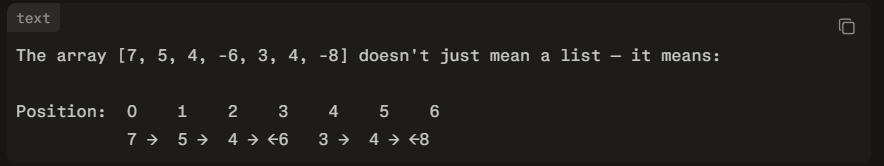

### MAIN INTUITION --> the interpretation of the direction can be understood from below diagram




### IMPORTANT INTUITION:	

1. **COLLISIONS ONLY HAPPENS WHEN negative asteroids COMES AFTER POSITIVE**
   - It can also collide with positive asteroids that survived previous collisions

2. if we get -ve first --> no need to add in stack -> directly add in result
   - this is because even if we have a positive indicator incoming, it was basically diverging and not converging in direction.

3. if a negative asteroid **SURVIVES ALL** positives ONLY then add to stack

#### SO basically a negative asteroid can NEVER be in the final answer UNLESS it is in the beginning which means that "it survived all collisions in ITS TIME"


## also we need to add final stack state to result in reverse order which can be done using the complex way here - or by using additional stack


```cpp


class Solution {
public:
    vector<int> asteroidCollision(vector<int>& asteroids) {

        stack<int> st;
        vector<int> result (asteroids.size());
        int fill_posi = 0;

        for(int ast : asteroids){

            if(ast < 0){ //this is a collision

                // base case: we get -ve as first element in a 'COLLISION SNAPSHOT' --> which means stack is empty --> directly add to result
                if(st.empty()){
                    result[fill_posi] = ast;
                    fill_posi++;
                    continue;
                }

                // simulate collision

                else{

                    bool destroyed = false;

                    while(!st.empty()){ // the collision can only go on until we dont have any more positive asteroids
                      
                        // greater than top --> collision and progress
                        if(abs(ast) > st.top()){
                            st.pop();
                        }

                        // less than top --> destroyed itself && END
                        else if(abs(ast) < st.top()){
                            destroyed = true;
                            break;
                        }

                        // equal to top --> destroyed itself and other && END
                        else{
                            st.pop();
                            destroyed = true;
                            break;
                        }
                    }


                    // IMPORTANT --> we need to ADD NEGATIVE ASTEROID TO RESULT IF IT SURVIVED ALL COLLISIONS
                    if(!destroyed) result[fill_posi++] = ast;
                }
            }

            else{ //positive so no collision - hence just push

                st.push(ast);

            }


        }


        // move the final state after ALL COLLISIONS into result by emptying the stack

        // ?? FUCK THIS MAN - we need to copy in reverse order - might use second stack -->>>>> i could also do this by defining result array as the size of asteroids and then keep a counter of how many have been inserted - which would help be to keep push the top element to `cnt + st.size()`
      
      
        int stack_size_snapshot = st.size();

        while(!st.empty()){

            result[fill_posi + st.size() - 1] = st.top();
            st.pop();
        }


        // resize for eliminating tail of zeroes
        result.resize(fill_posi + stack_size_snapshot) ;

        return result; 
    }
};

```
