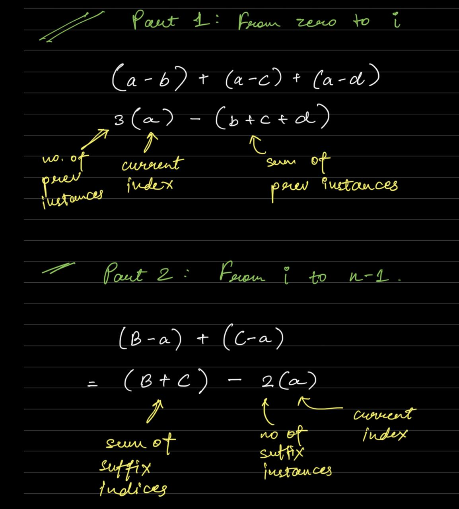
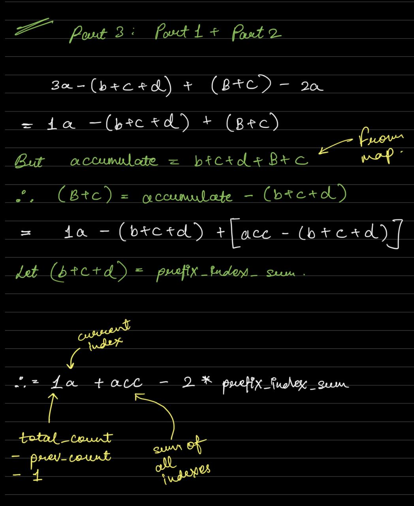

    

## BRUTE --> using MAP to track indices

```cpp

class Solution {
public:
    vector<long long> distance(vector<int>& nums) {


        // 1. push indexes in map

        unordered_map<int, vector<int>> map;

        int n = nums.size();
        for(int i = 0; i < n; i++){
            map[nums[i]].push_back(i);
        }

        vector <long long> result(n);

        for(int i = 0; i < n; i++){
          
            long long ans = 0;

            // 2. extract the vector
            vector <int> indices = map[nums[i]];

            for(int k = 0; k < indices.size(); k++){
              
                if (indices[k] == i) continue;  
                ans += abs(i - indices[k]);
            }

            // 3. got final answer to be written
            result[i] = ans;

        }
        return result;
    }
};

```

## OPTIMAL --> The math trick --> the simplified version somehow did not work --> therefore added part 1 and part 2


### NOTES:






### CODE:

```cpp
class Solution {
public:
    vector<long long> distance(vector<int>& nums) {


        // 1. push in map

        unordered_map<int, vector<int>> map;

        int n = nums.size();
        for(int i = 0; i < n; i++){
            map[nums[i]].push_back(i);
        }

        vector <long long> result(n);


        // - we have indices in map 
      
        for(auto& pair : map){

            // take indexes and calculate the accumulate

            auto& group = pair.second;
            long long acc = accumulate(group.begin(), group.end(), 0LL);

            // set 3 variables
            long long prev_count = 0;
            long long prev_index_sum = 0;
            long long total_indices = group.size();

            // now we will iterate in group to get the final answers

            for(auto& index : group){

                // SIMPLE Part 1 + Part 2

                long long part1 = prev_count * index - prev_index_sum;
                long long part2 = (acc - prev_index_sum - index) - (total_indices - prev_count - 1) * (long long) index;
              

                result[index] = part1 + part2;

                prev_count++;
                prev_index_sum += index;

            }

        }
        return result;
    }
};

```
